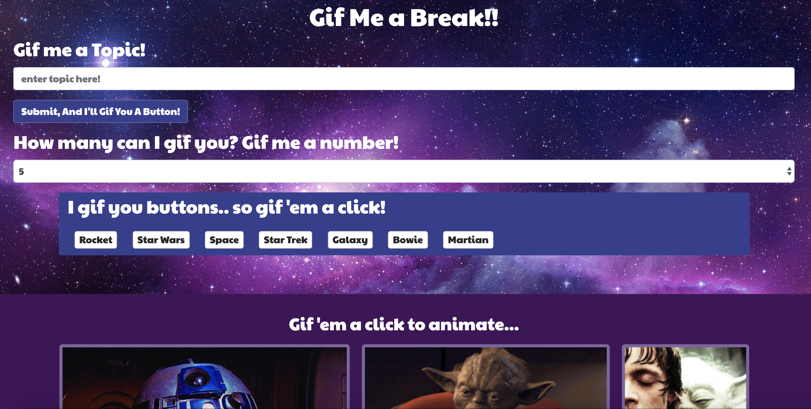

# Giftastic!

App to pull from Giphy API using JavaScript for the logic and jQuery to manipulate HTML. App includes AJAX method and CSS.

To view live application:   https://johandenver.github.io/GifTastic/

1. App allows user to pull a number of gifs on any topic from the Giphy API.

2. The User submits a topic to create new topic button, and also chooses the number of gifs to display.

3. If the user clicks on a topic button, the page will display the desired number of non-animated gif images from the GIPHY API. 

4. If the user clicks on the still gif it will animate. A second click will stop animation. 

5. Under every gif, the rating is displayed. This app has a rating limit of "PG". 

## Getting Started

Download zip file.

Open file in IDE of choice to view code.

Open index.html in browser to view application.

## Built With

* [Javascript](https://developer.mozilla.org/en-US/docs/Web/JavaScript) - The programming language used for all logic of the    game.
* [Bootstrap](https://getbootstrap.com/) - Used components from toolkit for developing the HTML layout. 
* [CSS](https://developer.mozilla.org/en-US/docs/Web/css) - used for styling of the application.
* [Google Fonts](https://fonts.google.com/) - Used to generate font styles.
* [Giphy API](https://developers.giphy.com/) - API used to generate gif files.

## Authors

* Jonathan Peine - Initial work - [Github](https://github.com/johandenver)

## Acknowledgments

* Would love to give a shout out to the TAs, Instructors, Tutor and study partners! 